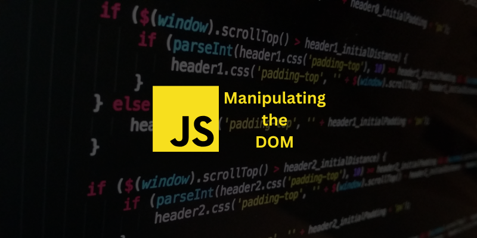

  

   Some of my JavaScript practices on the DOM

## 📂 Table of Contents
- [📋 Project Description](#-project-description)
- [⛏️ Built Using](#️-built-using)
- [🔍 Explore The Project](#-explore-the-project)
- [✍ Authors](#-authors)
- [💳 License](#-license)
- [🏅 Acknowledgments](#-acknowledgments)

## 📋 Project Description
This project aims to practice real-world scenarios of manipulating the DOM. The following are scenarios that are manipulated on the DOM:
- Building the navigation menu dynamically.
- Building a Responsive nav bar for the small screen.
- Hiding the nav bar when scrolling down and scrolling up makes it appear again
- Hiding fixed navigation bar while not scrolling.
- Adding a scroll to the top button on the page that’s only visible when the user scrolls below the fold of the page.
- Adding an active state to navigation items when a section is in the viewport.
- Adding an active state to sections when a section is in the viewport.
- Scrolling to the sections using nav bar elements when clicking on them.
- Making sections collapsible.

Note:
Html and CSS files have been given by Udacity to practice manipulating the DOM. and have edited some parts.

## ⛏️ Built Using
- [JavaScript](https://developer.mozilla.org/en-US/docs/Web/JavaScript): Interacting
- [CSS](https://developer.mozilla.org/en-US/docs/Web/CSS): Styling
- [HTML](https://developer.mozilla.org/en-US/docs/Web/HTML): Structuring

## 🔍 Explore The Project
- [Manipulating The DOM Practice](https://mohammed-dhabaab.github.io/manipulating-the-dom-practice/)

## ✍ Authors
- [@Mohammed-Aldhabaab](github.com/Mohammed-Aldhabaab)

## 💳 License
- [MIT](https://choosealicense.com/licenses/mit/)

## 🏅 Acknowledgments
- [Udacity](udacity.com)
- [SDA](https://sda.edu.sa/)
